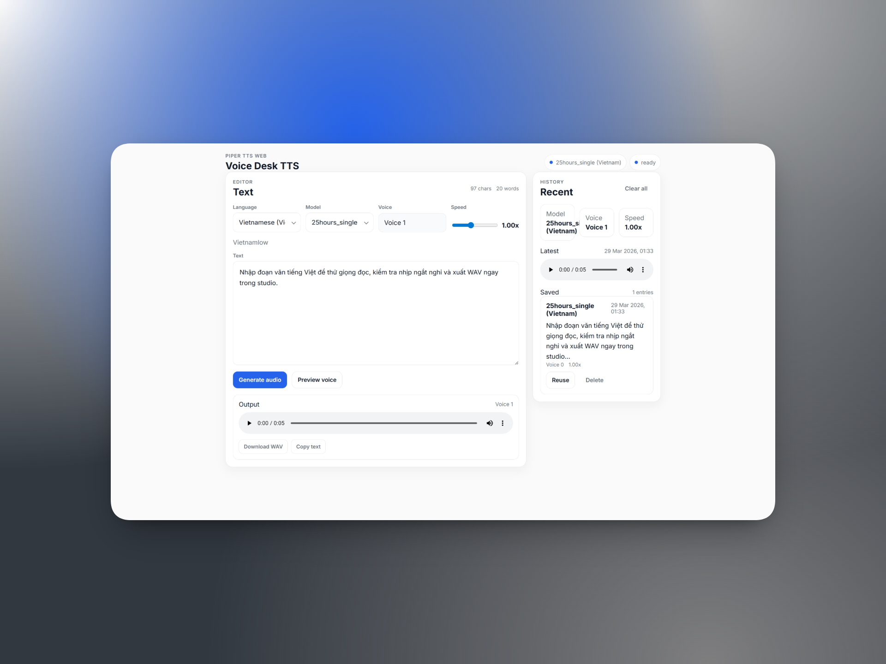
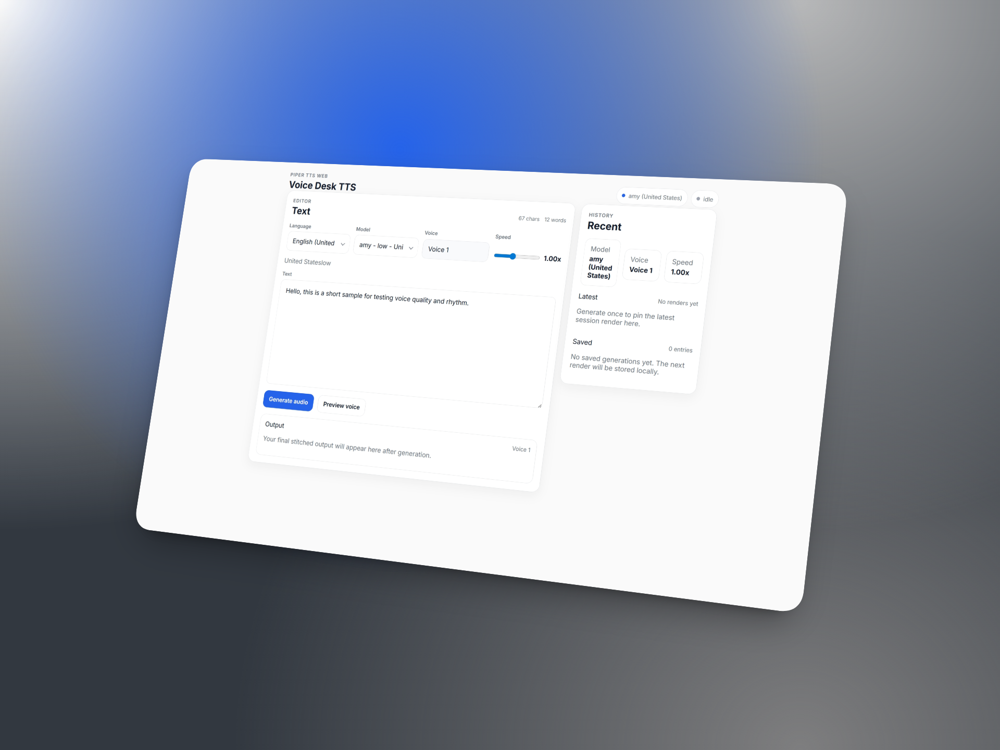

<p align="center">
  <h1 align="center">Voice Desk TTS</h1>
</p>

<p align="center"><strong>Workspace Piper TTS ưu tiên trình duyệt</strong></p>

<p align="center">
Thử giọng đọc local, nghe lại nhanh, và xuất WAV từ một phiên làm việc gọn gàng.
</p>

<p align="center">
  <a href="#chạy-nhanh">Chạy Nhanh</a> &bull;
  <a href="./docs/training-vi.md">Hướng Dẫn Train</a> &bull;
  <a href="./README.md">English</a> &bull;
  <a href="https://voice-desk-tts.pages.dev/">Demo</a>
</p>

<p align="center">
  
  
  
  
  
</p>

<p align="center">
  
</p>

<p align="center">
  
</p>

## Repo này phù hợp cho ai

Voice Desk TTS phù hợp nếu bạn muốn:

- chạy thử model Piper ngay trong trình duyệt
- so sánh nhiều giọng đọc mà không cần dựng backend riêng
- lưu lại các lần generate gần đây để nghe lại hoặc dùng lại
- đồng bộ catalog Piper chính thức để duyệt model dễ hơn
- train hoặc fine-tune voice qua workflow Colab đi kèm khi cần

## Điểm nổi bật

- giao diện React + Vite gọn, tập trung vào TTS
- chạy Piper ONNX trong browser bằng Web Workers
- hỗ trợ nhiều ngôn ngữ và nhiều nguồn model khác nhau để thử giọng linh hoạt hơn
- hỗ trợ catalog Piper chính thức với metadata đã chuẩn hóa
- phân loại model `stable` và `experimental` để phản ánh giới hạn thực tế trong browser
- lưu lịch sử generate cục bộ để nghe lại và tái sử dụng
- đi kèm tài liệu train và notebook Colab để đưa voice mới quay lại app nhanh hơn

## Vì sao repo này hữu ích

- giao diện gọn, tập trung vào đúng bài toán TTS
- chạy model ngay trong browser qua Web Workers
- hỗ trợ cả model local lẫn catalog Piper chính thức
- có lịch sử render để nghe lại, reuse, và kiểm tra nhanh
- có sẵn luồng Colab-first để train và export voice mới

## Chạy nhanh

### Yêu cầu

- Node.js 20+ khuyến nghị
- npm

### Cài dependency

```bash
npm install
```

### Thêm model local

Đặt cặp file model vào một trong các thư mục sau:

```text
public/tts-model/vi/
public/tts-model/en/
public/tts-model/id/
```

Mỗi model cần đúng 2 file:

- `voice-name.onnx`
- `voice-name.onnx.json`

### Tải sẵn bộ model tiếng Việt

Nếu muốn test nhanh, bạn có thể tải bộ model tiếng Việt dựng sẵn tại đây:

- [Trang release](https://github.com/izlabs/voice-desk-tts-assets/releases/tag/v0.1.0)
- [Tải bộ model tiếng Việt](https://github.com/izlabs/voice-desk-tts-assets/releases/download/v0.1.0/voice-desk-tts-vi-model-pack.zip)

Giải nén rồi chép các cặp `.onnx` và `.onnx.json` vào `public/tts-model/vi/`.

### Chạy local

```bash
npm run dev
```

### Build production

```bash
npm run build
```

### Kiểm tra lint

```bash
npm run lint
```

## Nguồn model được hỗ trợ

Voice Desk TTS hỗ trợ hai nguồn model chính:

- model local trong `public/tts-model/<lang>/`
- model từ catalog Piper chính thức sau khi được chuẩn hóa vào `public/tts-model/piper-catalog.json`

UI gộp cả hai nguồn theo ngôn ngữ, thay vì tách chúng thành hai chế độ duyệt riêng.

## Stable và Experimental

Không phải locale Piper nào cũng chạy giống nhau trong môi trường browser-only.

- `Stable`: các model hiện được kỳ vọng chạy ổn trong luồng browser-first
- `Experimental`: model có thể load được nhưng vẫn có nguy cơ fail ở bước phonemize hoặc generate

Hiện tại browser support mạnh nhất với:

- `vi_VN`
- `en_US`
- `id_ID`

Các locale khác vẫn có thể xuất hiện trong app, nhưng có thể bị đánh dấu `experimental` nếu pipeline phonemizer trong browser chưa khớp ổn định với model đó.

## Đồng bộ catalog Piper chính thức

Repo có sẵn script để tải và chuẩn hóa catalog Piper chính thức thành một file JSON thống nhất với các trường như:

- `language`
- `country`
- `voice_name`
- `quality`
- `model_url`
- `config_url`

Script cũng tách riêng nhóm multi-speaker như `en_US-libritts_r-medium`.

Chạy:

```bash
npm run catalog:piper
```

File đầu ra:

```text
public/tts-model/piper-catalog.json
```

Bạn cũng có thể dùng nguồn local:

```bash
node scripts/sync-piper-catalog.mjs --source ./path/to/voices.json
```

## Cấu trúc repo

```text
voice-desk-tts/
  src/                workspace TTS bằng React
  functions/api/      API và logic phục vụ model khi deploy
  public/             static assets, model local, catalog Piper đã chuẩn hóa
  scripts/            script tải voice và đồng bộ catalog
  docs/               tài liệu dự án và tài liệu train
  colab-train/        notebook Colab chính cho train và fine-tune
```

## Ghi chú khi deploy

Bản production mong đợi model TTS nằm dưới các prefix như:

- `piper/vi/`
- `piper/en/`
- `piper/id/`

Hãy cập nhật cấu hình deploy và storage cho phù hợp với môi trường hosting thật của bạn trước khi public.

## Train giọng mới

Tài liệu:

- English: [docs/training-en.md](./docs/training-en.md)
- Tiếng Việt: [docs/training-vi.md](./docs/training-vi.md)

Notebook Colab:

- [colab-train/voice_desk_tts_colab.ipynb](./colab-train/voice_desk_tts_colab.ipynb)

Sample dataset public mặc định trong notebook:

- [Tải sample dataset để train (`audio_train_demo.zip`)](https://github.com/izlabs/voice-desk-tts-assets/releases/download/v0.1.0/audio_train_demo.zip)

Bộ model tiếng Việt dựng sẵn:

- [Tải bộ model tiếng Việt (`voice-desk-tts-vi-model-pack.zip`)](https://github.com/izlabs/voice-desk-tts-assets/releases/download/v0.1.0/voice-desk-tts-vi-model-pack.zip)

Luồng làm việc điển hình:

1. Train hoặc fine-tune checkpoint Piper bằng workflow Colab trong [`colab-train/`](./colab-train).
2. Export `.onnx` và `.onnx.json`.
3. Chép cặp file sang `public/tts-model/<lang>/`.
4. Chạy app local để test voice mới.

## Trách nhiệm về model và dữ liệu

- Một số model giọng nói được đóng gói, tham chiếu, hoặc lấy từ catalog có thể đến từ nguồn bên thứ ba hoặc nguồn cộng đồng.
- Người sử dụng cần tự kiểm tra giấy phép, yêu cầu attribution, quyền phân phối lại, và khả năng dùng cho mục đích thương mại trước khi dùng hoặc public model hay dataset.
- Nếu bạn tự train hoặc fine-tune model bằng bản ghi âm hoặc dữ liệu riêng, bạn tự chịu trách nhiệm về quyền dữ liệu, sự đồng ý của chủ thể giọng nói, và việc tuân thủ các quy định pháp luật liên quan đến dữ liệu và giọng nói được tạo ra.

## License và attribution

Repo này có ranh giới license tách lớp:

- phần web app ở root: Apache-2.0
- notebook Colab và tài liệu train được cung cấp để thuận tiện cho workflow
- voice assets, checkpoints, datasets, và audio sinh ra không tự động thuộc license Apache của web app

Hãy đọc [ATTRIBUTION.md](./ATTRIBUTION.md) trước khi redistribute model, checkpoint, dataset, hoặc voice đã train.

## Ghi chú về phạm vi

Repo này hướng tới:

- một workspace TTS tập trung
- một công cụ thực dụng để thử model Piper local
- một app trung thực về giới hạn browser với các locale khó

Repo này không hướng tới:

- thay thế toàn bộ hệ Piper
- đảm bảo mọi locale Piper đều chạy hoàn hảo trong browser
- trở thành bộ công cụ ASR hoặc speech research đa năng

## Ủng hộ dự án

Nếu Voice Desk TTS giúp bạn tiết kiệm thời gian hoặc hữu ích cho công việc, bạn có thể ủng hộ tại đây:

<p align="center">
  <a href="https://paypal.me/llliz6">
    
  </a>
</p>

<p align="center">
  
</p>

<p align="center">
  Bạn có thể quét QR ngân hàng hoặc dùng PayPal để ủng hộ dự án.
</p>

## Ngôn ngữ

- Tiếng Việt: trang này
- English: [README.md](./README.md)

## Đóng góp

Nếu bạn muốn đóng góp, bắt đầu tại [CONTRIBUTING.md](./CONTRIBUTING.md).

Trước khi public repo hoặc fork chính thức, hãy xem [docs/release-checklist.md](./docs/release-checklist.md).
